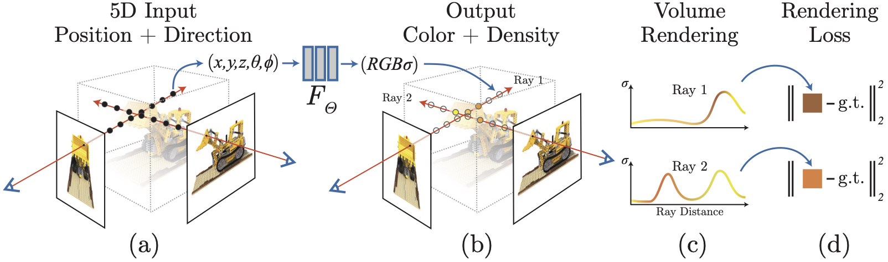

# NeRF-pytorch-blender
本项目是基于NeRF的pytorch实现，参考了github上[yenchenlin对NeRF的pytorch实现](https://github.com/yenchenlin/nerf-pytorch)。

本项目旨在让初学者更快地理解NeRF的代码实现，仅实现了[blender数据](https://drive.google.com/drive/folders/128yBriW1IG_3NJ5Rp7APSTZsJqdJdfc1)的加载。

几乎每一行代码均有详细的注释，同时在help.docx文档中介绍作者是如何实现本项目。

## 安装

```
# 从github克隆本项目
git clone https://github.com/hejinqiang1/nerf-pytorch-blender.git
在环境配置.txt文件中，有详细的环境配置教程
```

<details>
  <summary> 依赖项 (点击展开) </summary>
  
  ## 依赖项
  - PyTorch 1.12.0
  - matplotlib
  - numpy
  - imageio
  - imageio-ffmpeg
  - configargparse
  - ...

</details>

## 运行

### 快速开始

下载数据 : 

链接1谷歌云盘：[lego](https://drive.google.com/drive/folders/128yBriW1IG_3NJ5Rp7APSTZsJqdJdfc1)
链接2百度网盘：[lego](https://pan.baidu.com/s/1dLvaUExMq1P2vjcT7LUPoA?pwd=6vwy)

训练一个`lego`NeRF:
```
# 所有的config文件，即训练参数文件请存放在configs文件夹中，这里不给config参数也会默认训练lego
python run_nerf.py --config configs/lego.txt
```

训练不同模型：
```
python run_nerf.py --config configs/{DATASET}.txt
```

replace `{DATASET}` with `chair` | `drums` | `ficus` | `hotdog` | `lego` | etc.

### 预训练模型

下载预训练模型：[here](https://drive.google.com/drive/folders/1jIr8dkvefrQmv737fFm2isiT6tqpbTbv)

将预训练模型放在 `./logs` 文件夹下，文件组织格式如下：

```
├── logs 
│   ├── fern_test
│   ├── flower_test  # downloaded logs
│   ├── trex_test    # downloaded logs
```

## 方法

[NeRF: Representing Scenes as Neural Radiance Fields for View Synthesis](http://tancik.com/nerf)  
 [Ben Mildenhall](https://people.eecs.berkeley.edu/~bmild/)\*<sup>1</sup>,
 [Pratul P. Srinivasan](https://people.eecs.berkeley.edu/~pratul/)\*<sup>1</sup>,
 [Matthew Tancik](http://tancik.com/)\*<sup>1</sup>,
 [Jonathan T. Barron](http://jonbarron.info/)<sup>2</sup>,
 [Ravi Ramamoorthi](http://cseweb.ucsd.edu/~ravir/)<sup>3</sup>,
 [Ren Ng](https://www2.eecs.berkeley.edu/Faculty/Homepages/yirenng.html)<sup>1</sup> <br>
 <sup>1</sup>UC Berkeley, <sup>2</sup>Google Research, <sup>3</sup>UC San Diego  
  \*denotes equal contribution  
  


> A neural radiance field is a simple fully connected network (weights are ~5MB) trained to reproduce input views of a single scene using a rendering loss. The network directly maps from spatial location and viewing direction (5D input) to color and opacity (4D output), acting as the "volume" so we can use volume rendering to differentiably render new views

## Citation

```
@misc{mildenhall2020nerf,
    title={NeRF: Representing Scenes as Neural Radiance Fields for View Synthesis},
    author={Ben Mildenhall and Pratul P. Srinivasan and Matthew Tancik and Jonathan T. Barron and Ravi Ramamoorthi and Ren Ng},
    year={2020},
    eprint={2003.08934},
    archivePrefix={arXiv},
    primaryClass={cs.CV}
}
```

```
@misc{lin2020nerfpytorch,
  title={NeRF-pytorch},
  author={Yen-Chen, Lin},
  publisher = {GitHub},
  journal = {GitHub repository},
  howpublished={\url{https://github.com/yenchenlin/nerf-pytorch/}},
  year={2020}
}
```